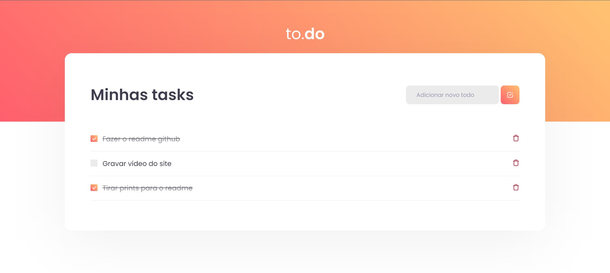
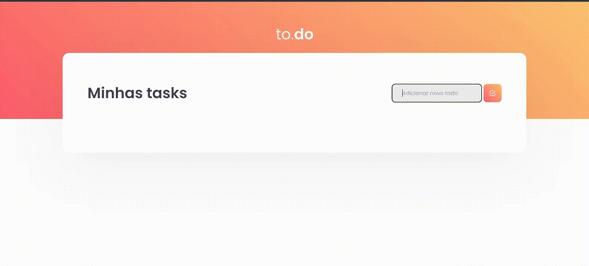

<!-- Começo/ Apresentação -->
<h1 align="center">📝 To-Do List 📌</h1>
<h3 align="center"> 📌 <a href="https://igorcbraz.github.io/Calculadora/" target="_blank">To-Do List</a> Feita no desafio Ignite ReactJs na Rocketseat 📝</h3>

<!-- Imagens do Projeto -->
<div align="center">
 <br>
</div>

<hr></hr> 

<h2 align="left">📝 HandleCreateNewTask:</h2>

> Desafio:
> Deve ser possível adicionar uma nova task no estado de tasks, com os campos id que deve ser gerado de forma aleatória, title que deve ser um texto e isComplete que deve iniciar como false.


<p>Após fazer uma simples validação se os o estado "newTaskTitle" não está vazio, podemos gerar o número aleatório(sendo o id da task) utilizando a função random do objeto embutido no Javascript: Math</p>

```
if(newTaskTitle !== ''){
  const randomNumber = Math.floor(Math.random() * 100); // Generates random integer from 0 to 99:

  //Adicionar a task para o state
} else {
  alert('Task cannot be empty !')
}
```

<p>Tendo em vista que temos todas as informações necessárias, agora precisamos apenas adiciona-lás ao state tasks. </p>
<p>Mas precisamos lembrar dos conceitos da imutabilidade dos states no React, então ao invés de usar o setTasks( ), é preciso clonar o array existente e então adicionar a nova pergunta</p>

```
if(newTaskTitle !== ''){
  const randomNumber = Math.floor(Math.random() * 100); // Generates random integer from 0 to 99:
  const newTask: Task = {
    id: randomNumber,
    title: `${newTaskTitle}`,
    isComplete: false
  } 

  setTasks(task => [...tasks, newTask]) //"Extends" old tasks array and add newTask item
} else {
  alert('Task cannot be empty !')
}
```
<p>Portanto, a primeira parte do desafio foi feita. Seguindo agora para: </p>
<h2>📌 HandleToggleTaskCompletion</h2>
<p>Primeiramente precisamos "limpar" o array de tasks, para indenficarmos qual a posição do id passado nos parâmetros  da função em questão. Para isso usamos a função findIndex( )</p>

```
const taskIndex = tasks.findIndex(task => task.id === id);
```

<p>Agora, sabendo qual a posição do id em questão podemos fazer um clone do array de tasks (lembrando da imutabilidade) para assim inverter o valor da propriedade "isComplete"</p>

```
const taskIndex = tasks.findIndex(task => task.id === id);
    
let newTaskArray = [...tasks]; //Clone old tasks array
newTaskArray[taskIndex].isComplete = !newTaskArray[taskIndex].isComplete; //Invert the boolean value from task with id = params id 

setTasks(newTaskArray); //Set the new array(newTaskArray) to Tasks state
```

<h2>📝 HandleRemoveTask</h2>
</p>Para remover uma task iremos usar a lógica do último método, alterando apenas a lógica de alteração para exclusão usando a função splice( )</p>

```
const taskIndex = tasks.findIndex(task => task.id === id);

let newTaskArray = [...tasks]; //Clone old tasks array
newTaskArray.splice(taskIndex, 1); //Remove 1 item with index = taskIndex

setTasks(newTaskArray) //Set the new array(newTaskArray) to Tasks state
```

<h3>Resultado Final 🥳:</h3>


   
